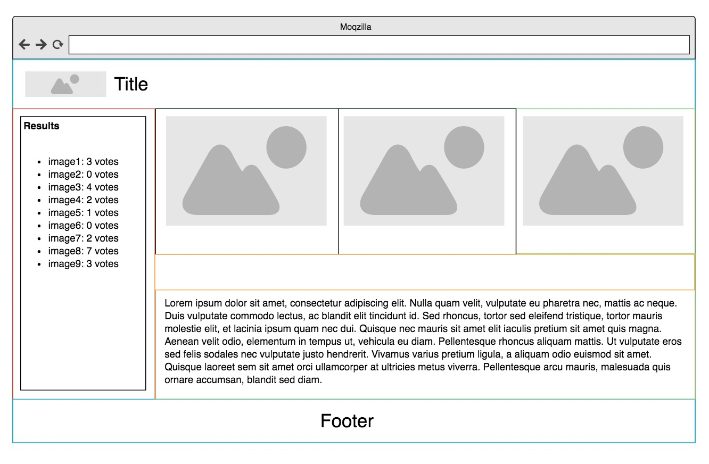

# Odd Duck Products

## Problem Domain

Odd Duck Product Co is trying to decide which project from their R&D department they should invest in next to sell.
They asked you to **make a web page that they can run at a kiosk at the front entrance of their campus**.
**Whenever an employee walks by, the employee can vote for 1 of the 3 products displayed that they think should be the next new product brought to market**.
After a week of collecting data, they would like some nice graphs to visualize the results.

To make this data collection project maximally effective, Odd Duck wants you to build an app that displays three
potential products side-by-side-by-side, without favoring any single product. You’ll need to manage the size and
the aspect ratio of the images.

As the app’s purpose is to have the staff members choose which product, of the three displayed images, that they
would be most interested in seeing as a new creation, you will need to store each anonymous vote, calculate totals,
and visually display the results.

To keep the product selection process as untainted as possible, you have been instructed to not allow any results to
be shown to users until there have been a total of 25 selections made.

The marketing team is not only interested in the total number of clicks, but also the percentage of times that an
item was clicked when it was shown. So, you’ll also need to keep track of how many times each image is displayed and do
the calculations.

You are also responsible for the look and feel of the app, so don’t forget a custom font, color palette, layout with
semantic HTML, and so on.

## Instructions

1. As a user, I would like to display three unique products by chance so that the viewers can pick a favorite.

   - Create a constructor function that creates an object associated with each product, and has the following properties:
     1. Name of the product
     2. File path of image
     3. Times the image has been shown

   - Create an algorithm that will randomly generate three unique product images from the images directory and display them side-by-side-by-side in the browser window.
   - For each of the three images, increment its property the amount of times it has been shown by one.
   - Attach an event listener to the section of the HTML page where the images are going to be displayed.
   - Once the users ‘clicks’ a product, generate three new products for the user to pick from.

2. As a user, I would like to track the selections made by viewers so that I can determine which products to begin production on.
   - In the constructor function define a property to hold the number of times a product has been clicked.
   - After every selection by the viewer, update the newly added property to reflect if it was clicked.

3. As a user, I would like to control the number of rounds a user is presented with so that I can control the voting session duration.
   - By default, the user should be presented with 25 rounds of voting before ending the session.
   - Keep the number of rounds in a variable to allow the number to be easily changed for debugging and testing purposes.

4. As a user, I would like to view a report of results after all rounds of voting have concluded so that I can evaluate which products were the most popular.
   - Create a property attached to the constructor function itself that keeps track of all the products that are currently being considered.
   - After voting rounds have been completed, remove the event listeners on the product.
   - Add a button with the text View Results, which when clicked displays the list of all the products followed by the votes received, and number of times seen for each. Example: banana had 3 votes, and was seen 5 times.
     - > NOTE: Displayed product names should match the file name for the product. Example: the product represented with dog-duck.jpg should be displayed to the user as exactly “dog-duck” when the results are shown.

5. Using Lighthouse in the Chrome DevTools, analyze the accessibility of your application.
   - In this module, try for a score higher than 80. Make necessary adjustments based on the report to achieve that score.
   - Add a screenshot of your score to your README.md file.
